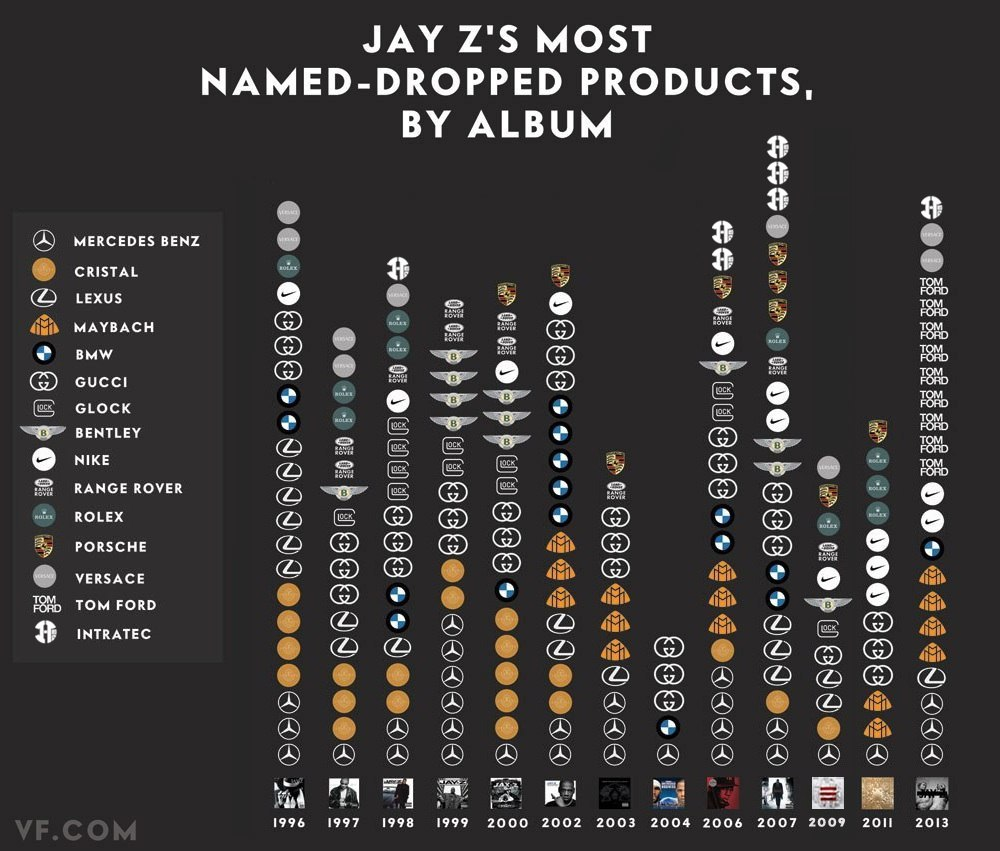

Objective
---

We're going to recreate this chart: 

**Source:** This was first published by Vanity Fair in October 2013. ([source](http://www.vanityfair.com/hollywood/2013/10/jay-z-brands-song-chart))

Steps Involved
---

1. **Data collection** - Create a scraper for downloading lyrics for each album. This should only take 1 python file that contains that downloads lyrics from RapGenius.
	- Output:  A directory named 'lyrics' that contains text files. Each file will be named with year then title. For example, `2007-Hello-Brooklyn.txt`.
2. **Data analysis** - Tokenize words and count each mention of a brand name. This should be 1 python file that reads the lyric text files and outputs a comma separated file described below.
	- Output: A comma separated file (CSV) that contains three columns: year, brand, frequency.
	- Resources: [Natural Language Processing with Python](http://www.nltk.org/book/) Book
3. **Data Visualization** - Plot data as a two-axis chart. A script that reads the CSV file and outputs a two axis chart. 
	- Output: an image file with the chart correctly annotated.

Python Libraries
---

### Setup and Installation: 

[@katychuang](http://github.com/katychuang) prepared a requirements.txt file that you can use to install needed libraries with pip. To use this, create a virtual environment and run `pip install -r requirements.txt`.

### Note: 

In order to run the tokenizing script, you'll need to download the stop words copora from NLTK. You can do that with this command `python -c "import nltk; nltk.download()"`

Reference
---

* Karteek Addanki and Dekai Wu. 2013. Unsupervised rhyme scheme identification in hip hop lyrics using hidden markov models. In Proceedings of the First international conference on Statistical Language and Speech Processing (SLSP'13), Adrian-Horia Dediu, Carlos Martín-Vide, Ruslan Mitkov, and Bianca Truthe (Eds.). Springer-Verlag, Berlin, Heidelberg, 39-50. DOI=10.1007/978-3-642-39593-2_3 http://dx.doi.org/10.1007/978-3-642-39593-2_3 [PDF](http://www.cs.ust.hk/~dekai/library/WU_Dekai/AddankiWu_Slsp2013.pdf) [ACM Library](http://dl.acm.org/citation.cfm?id=2530107)
* Matt Garley and Julia Hockenmaier. 2012. Beefmoves: dissemination, diversity, and dynamics of English borrowings in a German hip hop forum. In *Proceedings of the 50th Annual Meeting of the Association for Computational Linguistics: Short Papers - Volume 2* (ACL '12), Vol. 2. Association for Computational Linguistics, Stroudsburg, PA, USA, 135-139. [PDF](http://www.aclweb.org/anthology/P12-2027) [ACM Library](http://dl.acm.org/citation.cfm?id=2390699) 
* David Torres, Douglas Turnbull, Luke Barrington Gert Lanckriet. 2007. Identifying Words that are Musically Meaningful. In *ISMIR* Vol. 7, pp. 405-410. Chicago [PDF](http://cseweb.ucsd.edu/~datorres/bibs/MusicVocab_ISMIR07.pdf)

